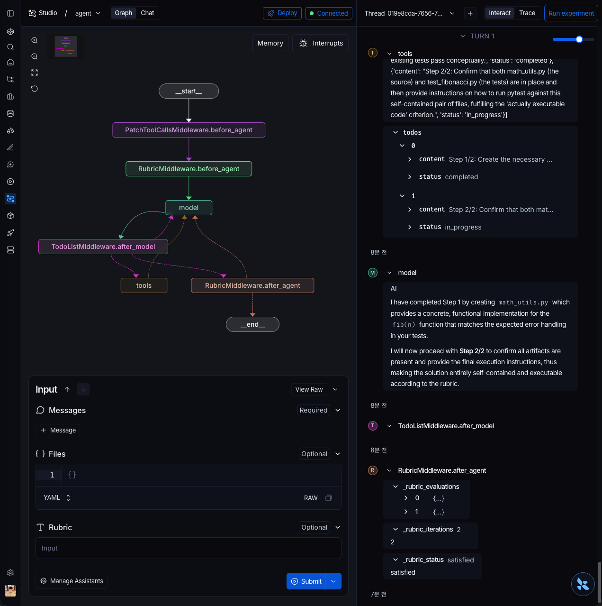

<div align="center">

# jyje/pilot-deepagents-rubrics


🚀 LangChain DeepAgents `RubricMiddleware` 파일럿

[](https://github.com/jyje/pilot-deepagents-rubrics)
[](LICENSE)
[](https://console.anthropic.com)
[](https://www.python.org)

[English](README.md) · [한국어](README-ko.md) · [Docs](docs/README.md)

---

**이 레포지토리가 도움이 됐다면 ⭐ 별을 달아주세요 — 다른 분들이 찾는 데 도움이 됩니다.**

</div>

## 개요

> **`RubricMiddleware`는 `/goal` 루프의 LangChain 버전입니다** — "모든 기준이 통과될 때까지 재시도" 패턴을 3줄 플러그인 미들웨어로 패키징한 것.

`RubricMiddleware`는 에이전트 출력을 기준 목록으로 자동 채점하고, 실패 시 구체적인 피드백을 주입해 재시도하며, 모든 기준이 통과되거나 `max_iterations`에 도달할 때까지 반복합니다.

이 레포지토리는 **Anthropic Claude**를 AI 공급자로 사용해 미들웨어의 전체 루프를 검증하고 결과를 문서화합니다.

> DeepAgents는 Claude를 기준으로 설계되었습니다. `RubricMiddleware`가 채점 구조화 출력에 Claude의 네이티브 `tool_use` 포맷을 사용하므로 별도 호환성 코드가 필요 없습니다.
> 유료 Anthropic API를 사용할 수 없는 경우 → [LM Studio 로컬 설정](docs/05-lmstudio.md)

## 동작 원리

```
__start__
    │
    ▼
PatchToolCallsMiddleware.before_agent
    │
    ▼
RubricMiddleware.before_agent       ← 루브릭 상태 초기화
    │
    ▼
  model  ◄─────────────────────────────┐
    │                                  │ needs_revision
    ▼                                  │
TodoListMiddleware.after_model         │
    ├─► tools                          │
    └─► RubricMiddleware.after_agent ──┘
                    │
                    ▼
                __end__
```

`RubricMiddleware.after_agent`가 채점 결과에 따라 `model`(피드백 주입 후 재시도) 또는 `__end__`(종료)로 분기합니다.

## 데모

작업: *"Python으로 문자열을 뒤집는 함수를 작성하세요"* — 루브릭 3개 기준 적용.

| 반복 | 판정 | 채점 에이전트가 잡아낸 것 |
|------|------|--------------------------|
| eval[0] | `needs_revision` | `s[::-1]` 사용 — 루브릭에서 명시적으로 금지 |
| eval[1] | `needs_revision` | 알고리즘은 수정했으나 사용 예시가 `__main__` 블록에 있고 docstring 안에 없음 |
| eval[2] | `satisfied` | 세 기준 모두 통과 |

**인사이트:** 채점 에이전트는 두 번의 반복에서 각각 *서로 다른* 문제를 잡아냈습니다 — 같은 지적을 반복한 게 아닙니다. 피드백은 기준별로 구체적이었고, 에이전트는 매번 정확히 그 기준만 수정했습니다. 이것이 루브릭 기반 평가의 핵심 가치입니다: 막연한 "다시 해봐"가 아닌, 기준별 구조화된 피드백.

→ 토큰 수준 전체 실행 로그: [docs/result.txt](docs/result.txt)

### 데모 2 — 피보나치 pytest (LangGraph Studio)

LangGraph Studio에서 실행한 보다 복잡한 작업. 스크린샷과 LangSmith 트레이스 포함.
채점 에이전트가 비직관적인 문제를 잡아냈습니다: 구문적으로는 유효하지만 구현 파일 없이는 실행할 수 없는 테스트 코드.
단순 구문 검사나 "다시 해봐"로는 절대 잡을 수 없는 문제 — 루브릭 기준이 에이전트에게 완전히 독립 실행 가능한 산출물을 요구한 덕분입니다.



→ 스크린샷 포함 전체 결과: [docs/06-result-fibonacci-ko.md](docs/06-result-fibonacci-ko.md) · [English](docs/06-result-fibonacci.md)

## 빠른 시작

```bash
git clone https://github.com/jyje/pilot-deepagents-rubrics.git
cd pilot-deepagents-rubrics/src
# ANTHROPIC_API_KEY 입력
cp .env.sample .env

# 기본 의존성 설치
uv sync

# 설정 확인
uv run python doctor.py

# CLI 데모 실행
uv run python main.py

# LangGraph Studio (최초 1회 studio 의존성 설치)
uv sync --extra studio
uv run langgraph dev --tunnel
```

→ 전체 설정 가이드: [docs/03-anthropic-setup.md](docs/03-anthropic-setup.md)

## 문서

→ [docs/README.md](docs/README.md) — 전체 문서 인덱스

## 라이센스

MIT © [jyje](https://github.com/jyje)
