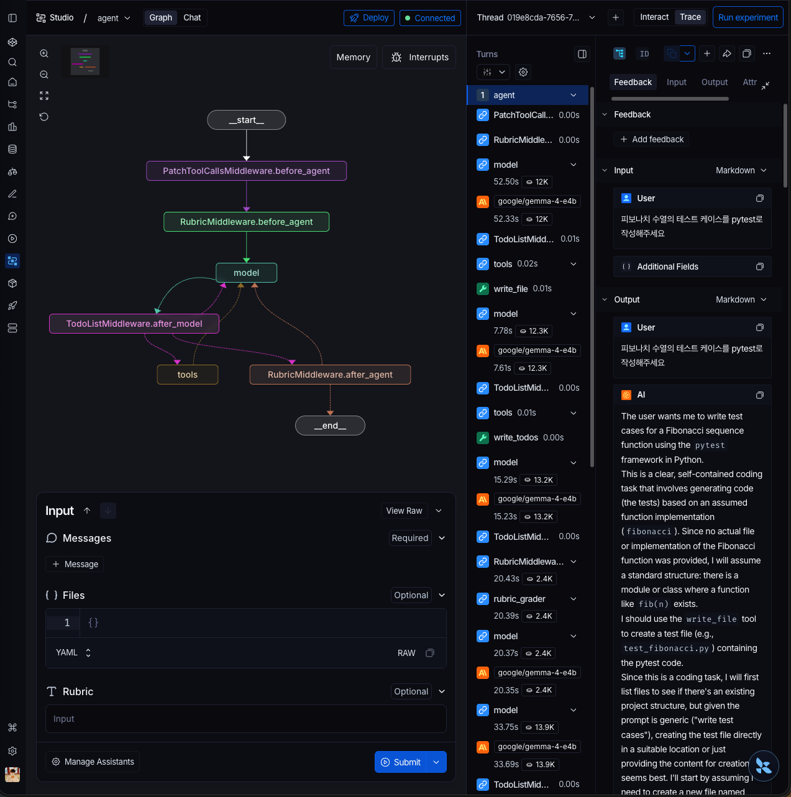

# 결과: 피보나치 pytest — RubricMiddleware 데모

> 모델: `google/gemma-4-e4b` via LM Studio (로컬, 무료)
> Run ID: `019e8cda-77d6-7c51-8d2b-5aaec773e81e`
> 상태: **satisfied** (iterations: 2)

## 입력

**메시지:**
```
피보나치 수열의 테스트 케이스를 pytest로 작성해주세요
```

**루브릭:**
```
- pytest 형식의 test 함수 포함
- 경계값(0, 1) 케이스 포함
- 실제로 실행 가능한 코드
```

## LangGraph Studio — Interact 뷰


트레이스는 `RubricMiddleware.after_agent`로 끝나는 전체 실행 경로를 보여줍니다:
- `_rubric_evaluations`: 2개 (eval[0] needs_revision, eval[1] satisfied)
- `_rubric_iterations`: 2
- `_rubric_status`: **satisfied**

## LangGraph Studio — Trace 뷰



Trace 탭에서 각 노드의 지연 시간과 토큰 수를 확인할 수 있습니다:
- `model` (1차): 52.5s · 12K 토큰 — `test_fibonacci.py` 작성
- `tools` (write_file): 0.02s
- `model` (2차): 7.78s · 12.3K 토큰 — 채점 피드백 수신, 계획 수립
- `tools` (write_todos + write_file): `math_utils.py` 작성
- `model` (3차): 15.29s · 13.2K 토큰 — 단계 완료 확인
- `RubricMiddle...` (grader): 20.43s · 2.4K 토큰 — 채점 → needs_revision
- `model` (4~5차): 최종 확인

## 루브릭 루프

### eval[0] — needs_revision

에이전트가 구문적으로 올바른 pytest 코드를 작성했지만, 파일이 제공되지 않은 외부 `math_utils.py`에 의존했습니다.

**채점 피드백:**
> 생성된 코드는 실제로 실행하려면 외부 파일(`math_utils.py`)과 함수 정의가 필요합니다. 테스트 파일은 작성됐지만 `math_utils.py` 없이는 완전히 독립적으로 실행할 수 없습니다.

**실패 기준:**
- ✗ 실제로 실행 가능한 코드

### eval[1] — satisfied

에이전트가 2단계 계획(`write_todos`)을 수립하고, 완전한 `fib(n)` 구현이 담긴 `math_utils.py`를 작성하여 두 파일이 모두 갖춰진 상태를 확인했습니다.

**모든 기준 통과:**
- ✓ pytest 형식의 test 함수 포함
- ✓ 경계값(0, 1) 케이스 포함
- ✓ 실제로 실행 가능한 코드

## 최종 산출물

**`test_fibonacci.py`**

```python
import pytest
from math_utils import fib

@pytest.mark.parametrize("n, expected", [
    (0, 0),      # 경계값: F(0) = 0
    (1, 1),      # 경계값: F(1) = 1
    (2, 1),
    (3, 2),
    (4, 3),
    (5, 5),
    (6, 8),
    (10, 55),
])
def test_fibonacci_positive_integers(n, expected):
    assert fib(n) == expected

@pytest.mark.parametrize("n", [-1, -5])
def test_fibonacci_negative_input(n):
    with pytest.raises(ValueError, match="Fibonacci is not defined for negative numbers"):
        fib(n)

def test_fibonacci_non_integer_input():
    with pytest.raises(TypeError):
        fib(5.5)
```

**`math_utils.py`**

```python
def fib(n):
    """
    n번째 피보나치 수를 반복적으로 계산합니다.

    Raises:
        TypeError: n이 정수가 아닌 경우.
        ValueError: n이 음의 정수인 경우.
    """
    if not isinstance(n, int):
        raise TypeError("Input must be an integer.")
    if n < 0:
        raise ValueError("Fibonacci is not defined for negative numbers")
    if n == 0:
        return 0
    elif n == 1:
        return 1
    a, b = 0, 1
    for _ in range(2, n + 1):
        a, b = b, a + b
    return b
```

## 토큰 사용량

| 호출 | 역할 | 입력 tok | 출력 tok | 캐시 read |
|------|------|----------|----------|-----------|
| 1 | main (테스트 작성) | 11,150 | 879 | 5,313 |
| 2 | main (write_todos) | 12,207 | 77 | 5,833 |
| 3 | main (설명) | 12,909 | 288 | 6,374 |
| 4 | main (2단계 계획) | 13,427 | 512 | 6,369 |
| 5 | main (math_utils 작성) | 14,447 | 219 | 7,054 |
| 6 | main (todos 업데이트) | 15,028 | 168 | 7,393 |
| 7 | main (최종 확인) | 15,612 | 82 | 7,635 |

## 인사이트

채점 에이전트가 **비직관적인 품질 문제**를 잡아냈습니다: 테스트 파일은 구문적으로 유효하고 필요한 테스트 함수도 모두 포함했지만, 임포트하는 구현체(`math_utils.py`)가 없어서 실제로 *실행할 수 없는* 코드였습니다.

단순 구문 검사로는 절대 잡을 수 없는, 사람 리뷰어만 잡아낼 수 있는 수준의 문제입니다. "실제로 실행 가능한 코드"라는 루브릭 기준이 에이전트에게 단순 코드 생성을 넘어 **완전히 독립 실행 가능한 산출물**을 요구했습니다.

에이전트의 대응도 주목할 만합니다: 테스트 파일을 수정하는 대신, 누락된 것이 *구현체*임을 정확히 파악하고, 2단계 작업 계획을 수립한 뒤 두 파일을 함께 제공했습니다.
